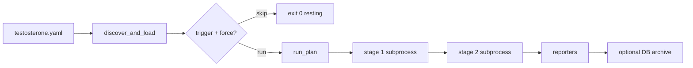

# QA Strategies

How Testo **triggers**, **executes**, and **logs** test suites today — from YAML cycles through artifacts, reporters, and optional database archives.

Related: [[Architecture Overview]], [[Command Reference]], [[Index]].

---

## Mental model

A **cycle** (plan) is an ordered list of **stages**. Each stage names an **equipment** framework (`pytest`, `behave`, `behavex`), a **target_repo**, and CLI **args**. The engine runs stages **one after another** on the host unless a trigger skips the whole cycle.



---

## Defining work in `testosterone.yaml`

Example cycle (from repo `testosterone.yaml`):

```yaml
cycles:
  sample-pytests:
    description: Pytest suite for the sample target repo
    tags: [smoke]
    stages:
      - name: pytest-sample
        equipment: pytest
        target_repo: sample_target_repo
        args: ["-q", "tests"]
```

**Multi-framework cycle:** `sample-all-frameworks` chains pytest → native Behave → BehaveX on `sample_target_repo`.

**Post-run reporters** (global `reporters:` block) run after all stages complete — Allure HTML, Extent dashboard, ReportPortal upload, TestBeats Slack/Teams preview.

Validate before running:

```bash
testo config validate
testo cycles show sample-pytests
```

---

## How runs are triggered

### 1. Manual CLI

Primary path:

```bash
testo run --cycle sample-pytests
```

Run every cycle (respecting each cycle’s trigger unless `--force`):

```bash
testo run --cycle all
testo run --cycle all --tag smoke
```

### 2. Selective triggers

Cycles may define a `trigger:` with glob `paths` (and optional Git `since_ref`). Evaluation lives in `testo_core/triggers.py`:

| Mode | Behavior |
|------|----------|
| **Git** | If config anchor is inside a Git repo, diff against `since_ref` or default ref; match changed files to patterns |
| **Snapshot** | Fallback: compare file mtimes/sizes to `.testo-trigger-snapshots/` under artifacts |

If no stimulus and not `--force`:

- Interactive: message that cycle is **resting** (skipped).
- Exit code **0** (not a failure).
- `--dry-run` shows `would be skipped (no trigger stimulus)`.

After a successful snapshot-triggered run, state is persisted via `persist_trigger_snapshot()`.

### 3. Watch mode (local TDD)

```bash
testo watch --cycle sample-pytests --path sample_target_repo
```

Debounced filesystem events call `testo run` repeatedly; useful for fast feedback loops.

### 4. CI/automation

| Mechanism | Notes |
|-----------|--------|
| `testo run --ci` | NDJSON on stdout for parsers |
| `testo run --no-persist` / `--no-report-db` | Lighter CI without DB |
| `uqo run --config …` | Legacy ghost/JSON contract (see `ARCHITECTURE.md`) |
| GitHub Action | `integrations/github-action/run_uqo_action.py` |
| `testo-api` | HTTP trigger + SSE log stream |

---

## How suites are executed

1. **Resolve config** — `discover_and_load`, `resolve_stages_for_plan` (env-specific stage filtering if configured).
2. **Pick renderer** — `BufferedRenderer` (default), `StreamRenderer` (`--stream`), or `CIRenderer` (`--ci`).
3. **`run_plan()`** (`testo_core/engine/orchestrator.py`):
   - Creates `artifacts/<cycle>/`.
   - Opens `events.ndjson` recorder.
   - For each stage: `run_stage()` in `executor.py`.
4. **`run_stage()`**:
   - Framework adapter builds `argv` (e.g. `pytest` with Allure plugin paths).
   - `subprocess.Popen` in `target_repo` cwd.
   - Merges `extra_env`; sets `UQO_SHARED_ALLURE_RESULTS_DIR`, `UQO_ARTIFACTS_ROOT`.
   - Streams stdout/stderr into `run.log` via `LogBuffer`.
   - Enforces `timeout_s` (SIGTERM → SIGKILL).
5. **`--fail-fast`** — aborts remaining stages (and `run --cycle all` aborts remaining cycles).
6. **Exit classification** — `classify_exit_code()` maps stage return codes to `EngineExitCode`.

**Not the default for `testo run`:** Docker-isolated execution (`testo_core/runners.py`) remains for the UQO platform path (compose stack, MinIO, Allure Server).

---

## How results are logged and surfaced

### On disk (always)

| Artifact | Location | Purpose |
|----------|----------|---------|
| Stage log | `artifacts/<cycle>/<stage>/run.log` | Full subprocess output |
| Allure raw | `…/allure-results/<framework>/` | `*-result.json` per test |
| Plan events | `artifacts/<cycle>/events.ndjson` | Machine-readable timeline |
| Plan summary | `artifacts/<cycle>/plan_result.json` | Aggregated outcome |

The collector (`testo_core/reporting/collector.py`) scans this tree; `testo report` uses the latest cycle when `--cycle` is omitted.

### Reporters (after run)

If `reporters:` is set or `--reporter` is passed, `run_configured_reporters()` runs:

- **allure** → `./reports/allure` (typical)
- **extent** → HTML dashboard under configured `output_dir`
- **reportportal** → REST launch import
- **testbeats** → webhook or preview JSON under `artifacts/reports/testbeats/`

### Official documentation

| Technology | Reference |
|------------|-----------|
| Allure Report | https://docs.qameta.io/allure/ |
| Allure Report (project site) | https://allurereport.org/docs/ |
| ReportPortal | https://reportportal.io/docs/ |
| ReportPortal agents | https://reportportal.io/docs/log-data-in-reportportal/test-framework-integration/ |

Local ReportPortal stack: [[ReportPortal Local Setup Guide]].

### Database archive (optional)

With `testo-core[db]` and `database.url` (or `DATABASE_URL`):

- Post-run zip of cycle artifacts + metrics row.
- `testo report list` / `testo report open --id …` / `testo diff` / `testo report compare`.

Use `--no-report-db` to skip; `--async-report-db` for background archive with join timeout (ignored under `--ci`).

### Unified Allure dashboard

```bash
testo report --cycle sample-pytests
```

Runs `allure generate` (with optional **trend** history from prior archives), serves local HTTP, opens browser by default.

**Native framework reports** (BehaveX HTML, etc.):

```bash
testo report native
```

---

## CI and streaming output

**`--ci` on `testo run`:**

- No Rich panels; NDJSON lines suitable for log aggregators.
- Same exit code contract as interactive mode.

**`--stream`:**

- Live stdout chunks per stage while subprocess runs.

**Dry-run in CI:**

```bash
testo run --cycle sample-pytests --dry-run --ci
```

Emits `dry_run_stage` objects with `argv`, `cwd`, `framework` without executing.

**Ghost mode (CI):** When running in a CI environment, prefer `testo run --ci` or rely on auto-detection so the CLI stays non-interactive: NDJSON or summary JSON on stdout, optional persistence to DB/S3, and enriched metadata (`trigger_source=ci`, `execution_mode=ghost`, provider ids). Override with `--ghost` / `--no-ghost`. Wrappers: [[CI-CD Pipeline Setup]]. Release gate: [[Release Checklist - Phase 2 Ghost Mode]].

---

## Recommended workflows

### Local smoke before commit

```bash
testo doctor
testo run --cycle sample-pytests
testo report --cycle sample-pytests --no-open
```

### PR gate (tagged cycles only)

```bash
testo run --cycle all --tag smoke --fail-fast --ci
```

Parse final `plan_finished` NDJSON line; fail pipeline on `exit_code != 0`.

### Nightly full matrix

```bash
testo run --cycle sample-all-frameworks
```

Or split cycles in CI jobs per `cycles:` key.

### Investigate regressions

```bash
testo report list
testo report compare --cycle sample-pytests
# or
testo diff <older-uuid> <newer-uuid>
```

### Clean slate

```bash
testo clean --yes
```

---

## Sample target repo

`sample_target_repo/` is the bundled **sandbox** under test:

- `tests/` — pytest + Allure
- `features/` — Behave / BehaveX BDD

Cycles in `testosterone.yaml` point `target_repo: sample_target_repo` for demos and docs. Replace with your application repo path in real projects.

---

## Testing the orchestrator itself

The repo’s own QA lives under `tests/`. The **modern `testo run` execution path** (CLI → runner → orchestrator → executor) has a dedicated suite aligned with [[Deep Dive - Execution Logic]] and [[Troubleshooting and Error Codes]].

### Layout

| Path | Focus |
|------|--------|
| `tests/fixtures/engine/` | YAML builders (`write_minimal_config`, `write_multi_stage_config`, `write_tagged_cycles_config`), `EchoAdapter`, `NoopRenderer`, `parse_ndjson`, `assert_ndjson_events`, `scripts/echo.py` + `scripts/hang.py` |
| `tests/unit/testo_core/engine/` | `classify_exit_code`, `LogBuffer`, `run_stage`, `run_plan`, lifecycle/state (`test_orchestrator_lifecycle.py`) |
| `tests/unit/testo_core/cli/` | Exit codes (`test_run_exit_codes.py`), archive (`test_run_archive.py`), flags (`test_run_flags.py`), CI NDJSON (`test_run_ci_ndjson.py`), config discovery, smokes |
| `tests/integration/testo_core/engine/` | Real subprocess smoke via `echo.py` (no Docker) |
| `tests/contract/testo_core/` | Formal `EngineExitCode` 0–4 contract (`test_exit_code_contract.py`) + legacy CLI contracts |
| `tests/unit/testo_core/` (legacy) | Headless/UQO path, reporters, triggers, archives |
| `tests/integration/` | Sandbox API, fuller paths |
| `tests/contract/` | Packaging, CI wrapper contracts |

### Coverage matrix (engine suite)

#### A. Exit-code contract (`EngineExitCode`)

| ID | Scenario | Expected | Test location |
|----|----------|----------|---------------|
| EC-00 | All stages pass | 0 | `test_exit_codes.py`, `test_run_exit_codes.py` |
| EC-01 | Framework failure (rc≠0, not 124/127) | 1 | `test_run_exit_codes.py` |
| EC-02 | Config/CLI validation | 2 | `test_run_exit_codes.py`, `test_config_discovery.py` |
| EC-03a | Missing binary (127) | 3 | `test_executor.py`, `test_run_exit_codes.py` |
| EC-03b | Stage timeout (124, `timed_out`) | 3 | `test_executor.py`, `test_run_exit_codes.py`, `test_orchestrator_lifecycle.py` |
| EC-03c–e | Sync/async archive failure, CI archive | 3 | `test_run_archive.py`, `test_run_exit_codes.py` |
| EC-04 | `internal_failure` / empty returncodes | 4 | `test_orchestrator.py`, `test_run_exit_codes.py`, `test_exit_code_contract.py` |
| EC-05 | Trigger resting (no stages) | 0 | `test_run_exit_codes.py` |
| EC-06 | `max(plan_exit, archive_exit)` | 3 | `test_run_archive.py` |
| EC-07 | Raw rc=4 without `internal_failure` → domain | 1 | `test_exit_code_contract.py` |

#### B. CLI flags

| ID | Scenario | Test location |
|----|----------|---------------|
| CLI-01–03 | Missing `--cycle`, dry-run, `--cycle all --fail-fast` | `test_run_exit_codes.py` |
| CLI-04 | `--cycle all --tag` filtering | `test_run_flags.py`, `test_run_exit_codes.py` |
| CLI-05–09 | `--workers`, `--stream`, `--reporter`, `--no-report-db`, `--async-report-db` | `test_run_flags.py`, `test_run_archive.py` |
| CLI-10 | `--ci` forces sync archive | `test_run_archive.py` |

#### C. Lifecycle & state

| ID | Scenario | Test location |
|----|----------|---------------|
| LC-01–06 | Artifacts, NDJSON, fail-fast, `plan_result.json` | `test_orchestrator.py`, `test_orchestrator_lifecycle.py` |
| LC-07–08 | Reporters post-run, trigger snapshot | `test_run_flags.py` |
| ST-01–08 | Logs, env carry-over, Allure wipe, NDJSON fields | `test_executor.py`, `test_log_buffer.py`, `test_orchestrator_lifecycle.py` |

#### D. CI NDJSON (`--ci`)

| Event | Test location |
|-------|---------------|
| `error`, `dry_run_stage`, `cycle_trigger`, `plan_started`, `stage_finished`, `plan_finished` | `test_run_ci_ndjson.py` |
| `plan_aborted` (artifact `events.ndjson`) | `test_run_ci_ndjson.py` |
| `error` on timeout (artifact mirror; stdout has `timed_out`) | `test_run_ci_ndjson.py` |

#### E. Integration smoke

| ID | Scenario | Test location |
|----|----------|---------------|
| INT-01 | `run_plan` + real `echo.py` subprocess (2 stages) | `test_subprocess_smoke.py` |
| INT-02 | Full `testo run --ci` with echo adapter | `test_subprocess_smoke.py` |

### Run locally

Dev install (matches CI):

```bash
pip install -e ".[dev]"
```

**Engine + CLI slice** (fast, ~2s; PR gate):

```bash
pytest tests/unit/testo_core/engine \
       tests/unit/testo_core/cli/test_run_exit_codes.py \
       tests/unit/testo_core/cli/test_run_ci_ndjson.py \
       tests/unit/testo_core/cli/test_run_flags.py \
       tests/unit/testo_core/cli/test_run_archive.py \
       tests/unit/testo_core/cli/test_config_discovery.py \
       tests/unit/testo_core/cli/test_cli_commands_smoke.py \
       tests/contract/testo_core/test_exit_code_contract.py -q --no-cov
```

**With integration smoke** (`tier_heavy`):

```bash
pytest tests/unit/testo_core/engine tests/unit/testo_core/cli/test_run_*.py \
       tests/unit/testo_core/cli/test_config_discovery.py \
       tests/unit/testo_core/cli/test_cli_commands_smoke.py \
       tests/integration/testo_core/engine \
       tests/contract/testo_core/test_exit_code_contract.py -q --no-cov
```

**Full unit surface:**

```bash
pytest tests/unit/testo_core -q
```

**With coverage** (default `pytest.ini` adds `--cov=testo_core --cov-fail-under=50`):

```bash
pytest tests/unit/testo_core/engine tests/unit/testo_core/cli -q
```

### CI/CD

| Workflow | Command | When |
|----------|---------|------|
| [`.github/workflows/pr-fast.yml`](../../.github/workflows/pr-fast.yml) | `pytest -m "tier_fast and not quarantined" --no-cov` | Every PR; engine unit + contract tests auto-marked `tier_fast` |
| [`.github/workflows/pr-heavy.yml`](../../.github/workflows/pr-heavy.yml) | `pytest -m "tier_heavy and not tier_external"` | Optional PR deep suite; includes `tests/integration/testo_core/engine/` |
| [`.github/workflows/nightly-external.yml`](../../.github/workflows/nightly-external.yml) | `pytest -m "tier_external and cleanup_required"` | Nightly / release |

Install step in CI: `pip install -e ".[dev]"`.

### Notes

- Tests **lock current exit-code behavior**, including known misclassifications documented in [[Troubleshooting and Error Codes#Classification logic]] (e.g. SIGKILL rc=137 → exit **1**); fixing those is a separate refactor.
- `CIRenderer` stdout omits `error` on `stage_finished`; the artifact `events.ndjson` mirror includes it — tests assert both surfaces where relevant.
- Legacy `uqo run` / `HeadlessEngineService` coverage remains in `test_cli_run.py` and `test_headless_engine.py`.
- Use [[Command Reference]] for operator-facing commands; this section is for contributors validating engine changes.

## Related operational docs

- [[E2E Harness Operations Guide]] — tiered E2E harness for this repo
- [[Release Management/README]] — phase release checklists
- [[CI-CD Pipeline Setup]] — GitHub Action / GitLab template
- [[Product Roadmap]] — phased WHY
